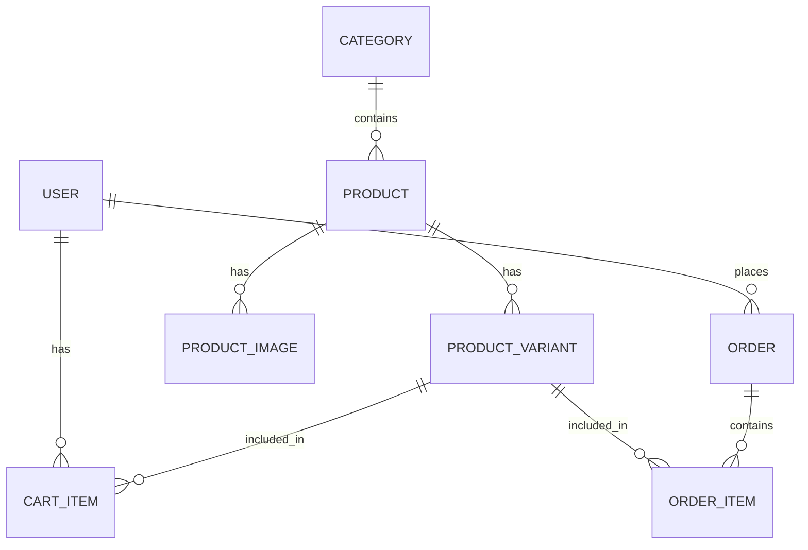

# Backend API Project Overview: Full Clothing Store App

This document provides a comprehensive overview of the `backend-api` project, built using the NestJS framework. It serves as the central hub for business logic, data management, and integration for the entire Clothing Store ecosystem.

## 1. Project Context

The `backend-api` is the core engine of a larger e-commerce system that includes:

- **Admin Panel**: Next.js dashboard for managing products, orders, and users.
- **Frontend User**: Next.js customer-facing storefront.
- **Backend API**: The NestJS server (this project) that powers both frontends.

---

## 2. Technology Stack

| Layer              | Technology                              |
| :----------------- | :-------------------------------------- |
| **Framework**      | [NestJS](https://nestjs.com/) (Node.js) |
| **Language**       | TypeScript                              |
| **ORM**            | [Prisma](https://www.prisma.io/)        |
| **Database**       | PostgreSQL                              |
| **Authentication** | Passport.js (JWT)                       |
| **Documentation**  | Swagger / OpenAPI                       |
| **Validation**     | class-validator & class-transformer     |

---

## 3. Core Features & Responsibilities

The backend is designed to handle the following domains:

- **🔐 Authentication & Security**: JWT-based login, registration, and role-based access control (Admin vs. Customer).
- **📦 Product Management**: CRUD operations for products, supporting multiple images and variations.
- **👔 Variant System**: Managing specific product combinations (e.g., Size: M, Color: Black).
- **🛒 Shopping Cart**: Persistent cart management for authenticated users.
- **🧾 Order Processing**: Handling checkouts, order item creation, and status tracking (Pending → Delivered).
- **📁 File Management**: Handling image uploads for products and profiles.
- **📊 Analytics**: Providing statistics for the admin dashboard.

---

## 4. Database Schema (Prisma)

The database consists of 8 primary models:



### Key Models:

- **User**: Name, Email, Password, Role (ADMIN/CUSTOMER).
- **Product**: Name, Description, Base Price, Category relation.
- **ProductVariant**: Specific combo of Size + Color + Price + Stock.
- **Order**: Total Amount, Status, Shipping info.

---

## 5. Planned API Architecture

The project follows a modular NestJS architecture:

```text
backend-api/
├── prisma/               # Database schema and migrations
├── src/
│   ├── modules/          # Feature-based modules
│   │   ├── auth/         # Login, Register, JWT logic
│   │   ├── users/        # Profile and user management
│   │   ├── products/      # Product & Variant logic
│   │   └── orders/       # Order & Checkout logic
│   ├── common/           # Shared guards, decorators, filters
│   ├── config/           # App, Database, and JWT config
│   └── database/         # Prisma service abstraction
└── main.ts               # Entry point
```

---

## 6. Development Status

> [!NOTE]
> **Current Phase: Skeleton / Setup**
> The project has been initialized as a NestJS application. The architecture is defined and the `README.md` provides a clear roadmap.
> Next steps include installing dependencies (`prisma`, `@nestjs/jwt`, etc.) and generating the feature modules.

---

## 7. Useful Commands

- **Start Dev Server**: `npm run start:dev`
- **Database Studio**: `npx prisma studio`
- **Create Migration**: `npx prisma migrate dev --name <migration_name>`
